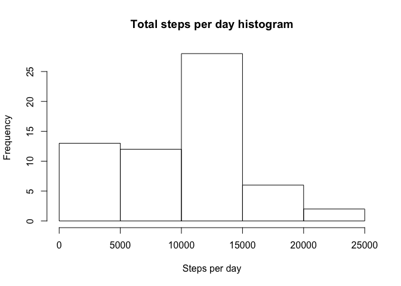
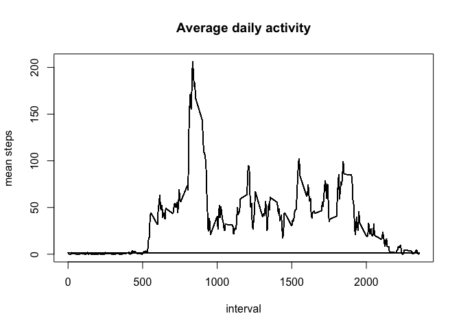
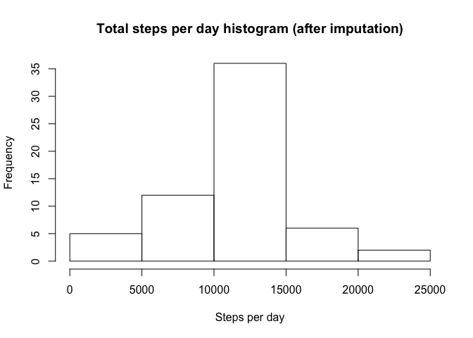
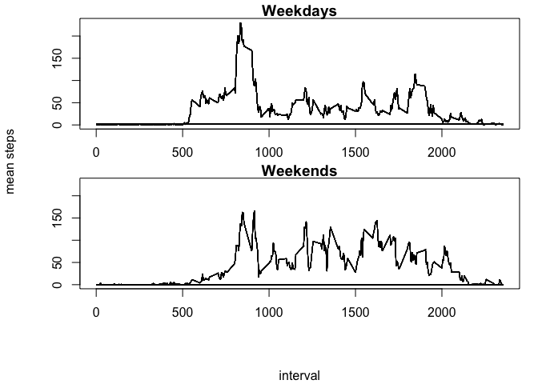

```r
library(dplyr)
options(scipen=999)
```

## Loading and preprocessing the data

```r
activity_df <- read.csv(unz("activity.zip", "activity.csv"), header = T, na.strings = "NA")
activity_df$date <- as.Date(as.character(activity_df$date), "%Y-%m-%d")
```


## What is mean total number of steps taken per day?

```r
total_steps_per_day <- tapply(activity_df$steps, activity_df$date, sum, na.rm=T)

# Make histogram of total steps per day
hist(total_steps_per_day, main="Total steps per day histogram", xlab="Steps per day")
```

<!-- -->

```r
# Mean total steps per day
round(mean(total_steps_per_day, na.rm=T), 2)
```

```
## [1] 9354.23
```

```r
# Median total steps per day
round(median(total_steps_per_day, na.rm=T), 2)
```

```
## [1] 10395
```


## What is the average daily activity pattern?

```r
activity_df <- activity_df %>%
    group_by(interval) %>%
    mutate(steps_interval_mean = mean(steps, na.rm=T)) %>%
    as.data.frame

with(activity_df,
     plot(interval, steps_interval_mean, type="l", main="Average daily activity", ylab="mean steps"))
```

<!-- -->

```r
# Interval with maximum average daily steps
activity_df[which.max(activity_df$steps_interval_mean),]$interval
```

```
## [1] 835
```

## Imputing missing values

```r
# Calculate missing step data
missing_steps_logical <- is.na(activity_df$steps)
missing_data_count <- sum(missing_steps_logical)
fraction_missing_data_perc <- round(mean(missing_steps_logical) * 100, 2)
```

2304 missing 'steps' datapoints (13.11 %)


```r
# Impute missing step data with interval step means
activity_df[missing_steps_logical,]$steps <- activity_df[missing_steps_logical,]$steps_interval_mean

total_steps_per_day <- tapply(activity_df$steps, activity_df$date, sum, na.rm=T)

# Make histogram of total steps per day
hist(total_steps_per_day, main="Total steps per day histogram (after imputation)", xlab="Steps per day")
```

<!-- -->

```r
# Mean total steps per day (after imputation)
round(mean(total_steps_per_day, na.rm=T), 2)
```

```
## [1] 10766.19
```

```r
# Median total steps per day (after imputation)
round(median(total_steps_per_day, na.rm=T), 2)
```

```
## [1] 10766.19
```

## Are there differences in activity patterns between weekdays and weekends?

```r
# Add factor to distinguish between weekday and weekend
weekends_logical <- weekdays(activity_df$date) %in% c("Saturday", "Sunday")
activity_df$weekday <- factor(!weekends_logical)

activity_weekday_tbl <- activity_df %>% 
    filter(weekday == TRUE) %>%
    group_by(interval) %>%
    mutate(steps_interval_mean = mean(steps))

activity_weekend_tbl <- activity_df %>% 
    filter(weekday == FALSE) %>%
    group_by(interval) %>%
    mutate(steps_interval_mean = mean(steps))

y_range <- range(range(activity_weekday_tbl$steps_interval_mean), range(activity_weekend_tbl$steps_interval_mean))

par(mfrow = c(2,1),
          oma = c(4,4,0,0) + 0.1,
          mar = c(2,1,1,1) + 0.1)
plot(activity_weekday_tbl$interval, activity_weekday_tbl$steps_interval_mean, type="l", main="Weekdays", ylim=y_range, ylab="", xlab="")
plot(activity_weekend_tbl$interval, activity_weekend_tbl$steps_interval_mean, type="l", main="Weekends", ylim=y_range, ylab="", xlab="")
title(xlab = "interval",
      ylab = "mean steps",
      outer = TRUE, line = 3)
```

<!-- -->


